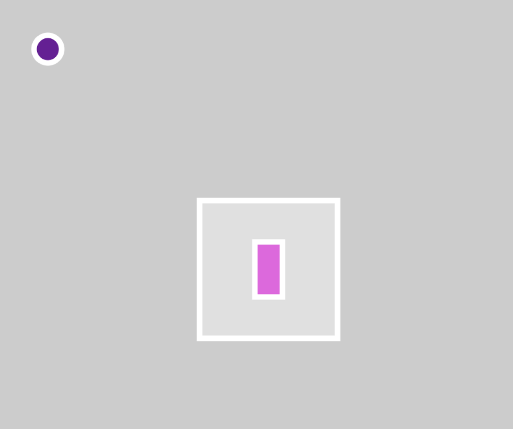
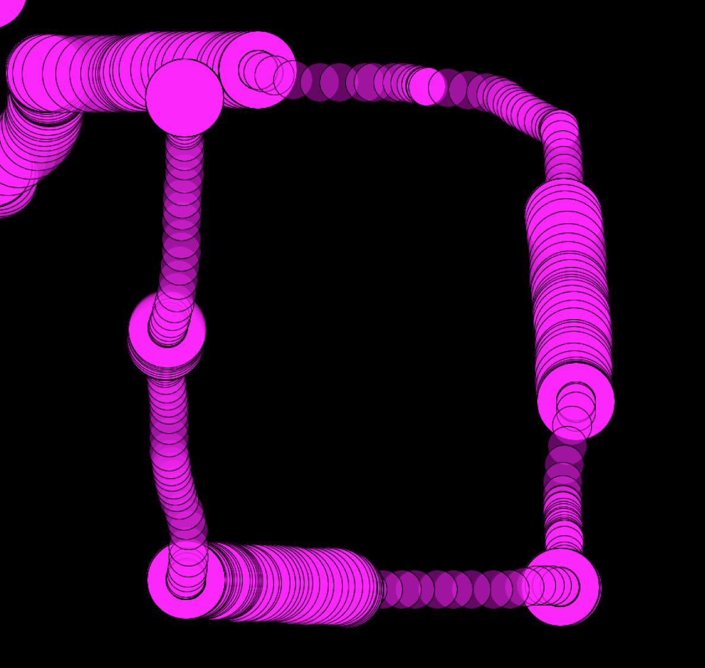

# Disciplina "Programação Criativa"

## Aula 1

```python
size (1000,1000)
#caixa alta pois é uma constante
rectMode(CENTER)

#cor em RGB
fill(200,0,200)
stroke(255,255,255)
strokeWeight(10)
rect(width/2, height/2, 50, 100)

#cor em hexa
fill('#651895')
#quando os numeros sao iguais
stroke(255)
circle(100,100,50)

#ultimo numero é o alfa para transparente
fill(255, 255, 255, 100)
stroke(255)
#quando os numeros sao iguais
square(width/2, height/2, 250)

```


```python
def setup():
    size (1000,1000)

def draw():
#CENTER em caixa alta pois é uma constante
    rectMode(CENTER)
    
    fill(200,0,200)#cor em RGB
    stroke(255,255,255)
    strokeWeight(10)
    rect(width/2, height/2, 50, 100)
    
    fill('#651895')#cor em hexa
#quando os numeros sao iguais
    stroke(255)
    circle(mouseX,mouseY,50)
#ultimo numero é o alfa para transparente
    fill(255, 255, 255, 100)
#quando os numeros sao iguais usamos só um parametro
    stroke(255)
    square(width/2, height/2, 250)

```


```python
def setup():
    size (1000,1000)
    background(0)

def draw():
   
    fill(255,0,255, 100)
    rectMode(CENTER)
    if mousePressed:
        circle(mouseX,mouseY,50)

```


```python
def setup():
    size (1000,1000)
    background(0)

def draw():
    fill(255,0,255, 100)
    rectMode(CENTER)
    sorteio = random(120,179)
    if mousePressed:
        circle(mouseX,mouseY,50)
   else :
       circle(mouseX,mouseY,100)

```

