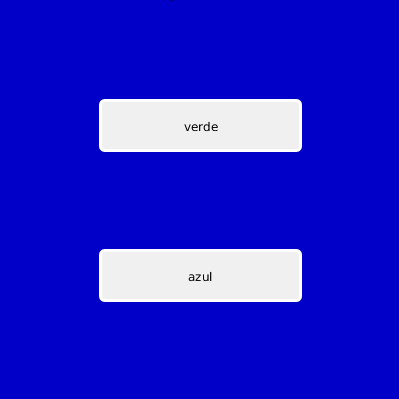

## Um botão simples



Aqui um exemplo de um botão muito simplificado, basicamente uma função que desenha um retângulo aredondado com texto e que devolve `True` caso o mouse esteja apertado sobre ele (`False` caso contrário).

```python
fundo = color(0, 0, 200)

def setup():
    size(400, 400)
    strokeWeight(3)
    stroke(255)

def draw():
    global fundo
    background(fundo)
    
    if botao_simples(100, 100, 200, 50, "verde"):
        fundo = color(0, 100, 0)

    if botao_simples(100, 250, 200, 50, "azul"):
        fundo = color(0, 0, 200)

def botao_simples(x, y, w, h, texto):
    # mouse_over vale `True` quando o mouse está sobre a área do botão
    mouse_over = (x < mouseX < x + w and y < mouseY < y + h)
    if mouse_over:
        fill(140)  # cinza escuro com o mouse sobre o botão
    else:
        fill(240)  # cinza claro sem o mouse sobre o botão
    rect(x, y, w, h, 5)  # o último argumento, 5 é o raio dos cantos do retângulo aredondado
    fill(0)
    textAlign(CENTER, CENTER)
    text(texto, x + w / 2, y + h / 2)
    # A função devolve verdadeiro se estiver com o mouse sobre o botão E o mouse apertado
    if mouse_over and mousePressed:
        return True
    else:
        return False
 ```
    
Repare que o comportamento deixa um pouco a desejar em relação a um botão apresentado pela interface do sistema operacional ou de um site. O código anterior é acionado no momento do pressionar do botão do mouse, os botões tradicionais são acionados no momento em que o botão do mouse é solto, completando um 'clique'.
    
É possível obter um comportamento semelhante de acionamento com um clique completo repetindo uma chamada de função para os botões, uma vez em `draw()` para visualização e outra na função de evento `mouseClicked()`, como no código abaixo:
    
```python
fundo = color(0, 0, 200)

def setup():
    size(400, 400)
    strokeWeight(3)
    stroke(255)

def draw():
    background(fundo)
    # desenha os botões mas ignora o resultado
    botao_clique(100, 100, 200, 50, "verde")
    botao_clique(100, 250, 200, 50, "azul")

def mouseClicked():
    global fundo
    # confere clique na posição do botão verde
    if botao_clique(100, 100, 200, 50, "verde"): 
        fundo = color(0, 100, 0)
    # confere clique na posição do botão azul
    if botao_clique(100, 250, 200, 50, "azul"): 
        fundo = color(0, 0, 200)
                        
def botao_clique(x, y, w, h, texto):
    mouse_over = (x < mouseX < x + w and y < mouseY < y + h)
    if mouse_over:
        fill(140)
    else:
        fill(240)
    rect(x, y, w, h, 5)
    fill(0)
    textAlign(CENTER, CENTER)
    text(texto, x + w / 2, y + h / 2)
    # Alterado! Agora devolve verdadeiro com mouse_over apenas
    if mouse_over:
        return True
    else:
        return False
```

### Assuntos relacionados

- Mais sobre [interação/input com mouse e teclado](input_py.md)
- Fazendo um [botão com orientação a objetos](botao_com_OO.md)
