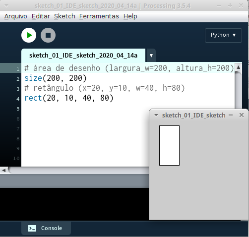

# Primeiros passos e desenho básico

Se você seguiu os passos [para instalar o Processin modo Python](https://abav.lugaralgum.com/como-instalar-o-processing-modo-python/), experimente digitar o código abaixo, e, em seguida, clique no botão com a seta triangular para frente (Executar/*Run*):

```pyde
size(200, 200)
rect(20, 10, 40, 80) 
``` 

)

**Experimente alterar os números entre parênteses e executar novamente...**

## Área de desenho e coordenadas

Usamos a função `size()` para determinar o tamanho da área de desenho (sem ela é gerada uma pequena tela de 100 por 100 pixels). Processing nos oferece automaticamente duas variáveis `width` e `height` que referenciam os valores de largura e altura da área de desenho, respectivamente.

```python
size(600, 400) # tamanho da tela size(largura, altura) 
print(width) # escreve no console largura atual da tela
print(height) # escreve no console altura atual da tela
```

O computador precisa saber a posição de cada ponto que desenha. Para fazer isso, normalmente usamos coordenadas cartesianas. Os eixos X e Y nos permitem especificar uma posição precisa na grade usando um par de números, normalmente o valor x seguido pelo valor y. 

Note que o eixo X cresce para a direita como de costume, mas o eixo Y é 'invertido' com valores crescendo 'para baixo'. Por exemplo, um ponto em (5, 14) fica a 5 unidades da borda esquerda da tela e 14 unidades para baixo do topo. 


## Desenhando algumas formas

```python
rect(20, 10, 40, 80) # retângulo (x, y, largura, altura)
ellipse(10, 20, 50, 50) # oval (x, y, largura, altura)
line(10, 10, 50,50) # linha do ponto 1 ao ponto 2 (x1, y1, x2, y2)
point(100, 50) # ponto em (x, y)
# nas versões mais novas do Processing
square(100, 50, 40) # quadrado na posição x:100 y:50 e lado:40
circle(50, 100, 40) # círculo na posição x:50 y:100 e diâmetro:40
```

## Cores e atributos gráficos (preenchimento e traço de contorno)

Para mudar as cores do preenchimento branco e do traço de contorno preto que são usadas inicialmente para desenhar as formas, indicamos inicialmente 3 números de 0 a 255 para definir uma combinação de vermelho (R), verde (G) e azul (B). 
É preciso definir a cor *antes* de pedir o desenho de uma forma! 

```python
fill(0, 255, 0) # preenchimento verde
ellipse(50, 50, 50, 50) # produz um círculo verde
```

É possível ajustar a cor de preenchimento de uma forma com `fill()` a cor de traço do contorno com `stroke()`, pedir uma forma sem preenchimento com `noFill()` ou sem traço de contorno com `noStroke()`. A espessura do traço de contorno pode ser contolada com `strokeWeight()`.

```python
noFill() # sem preenchimento, formas vazadas
stroke(0, 0, 255) # exemplo de cor do traço azul cor(R, G, B)
strokeWeight(10) # espessura do traço de contorno 10 pixels
noStroke() # sem traço de contorno
```

A cor indicada pode conter além dos 3 números (R, G, B) um quarto número de transparênica (Alpha). 

```python
fill(255, 0, 0, 100) # preenchimento vermelho (R:Vermelho, G:Verde, B:Azul, Alpha:Transparência)
```

## Fundo (*background*) e limpeza da área de desenho

O fundo também serve para apagar a área de desenho

```python
background(0, 255, 0) # fundo verde, limpa a tela background(R, G, B)
```

## Comentários, o que são e como criar comentários em Python?

Comentários são anotações, pedaços do código que não são executados pelo computador, são ignorados.
Comentário são feitos para as pessoas (como você, daqui a uma semana! lembrarem qual era o objetivo daquele pedaço do programa. São lembretes e explicações. Anote o seu código com comentários, mas não esqueça de mudá-los quando o código mudar.

Comentários de uma linha só começam com `#`. São também um jeito rápido de desativar uma linha! Em inglês tem até uma expressão para isso: *comment out* (desativar por meio de um comentário)

 ``pyde
# Oi eu sou um comentário
size(900, 900)  # área de desenho maior - outro comentário
# background(0) <- desativado, pq isso aqui virou um comentário

"""
Extra: Com três aspas no começo e no final, podemos produzir textos (strings)
que funcionam como comentários de múltiplas linhas e que quando estão logo
após o cabeçalho de definição de uma função, no começo do corpo, são chamados
docstrings (textos de documentação) - não se preocupe com isso agora.
"""
```
---
Este material é baseado no material do curso [Progração Criativa](https://arteprog.space/programacao-criativa/)

---
Texto e imagens / text and images: CC BY-NC-SA 4.0; Código / code: GNU GPL v3.0 exceto onde explicitamente indicado por questões de compatibilidade.
