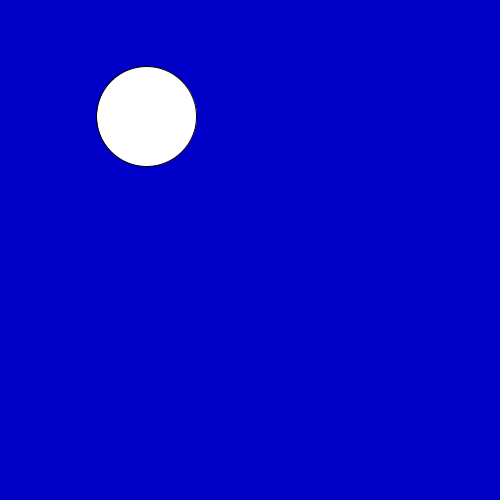

# Como exportar uma imagem

Um *frame* é o resultado visual produzido na área de desenho do *sketch* no Processing em um determinado momento. Para salvar um *frame* em um arquivo bitmap/raster, como por exemplo PNG, TIF ou JPG, usamos a função `saveFrame()`.

Passamos como argumento o nome do arquivo que deve ser salvo, e a extensão de três letras após o ponto no nome do arquivo indica o formato que deve ser salvo. Por exemplo `saveFrame("imagem.jpg")` salva um arquivo JPG na pasta do *sketch*. Se utilizarmos alguns caracteres "#" no nome do arquivo eles serão substituídos pelo número do *frame*. 

O código abaixo exemplifica como salvar uma imagem PNG de um frame. Quando uma tecla é pressionada, é executada a função `keyPressed()` e se for identificada a tecla "s" (`key == 's'`) é execuatada a função saveFrame(), que grava uma imagem na pasta do sketch.

### Um exemplo bem simples

O código abaixo exemplifica como salvar uma imagem PNG de um frame. Quando uma tecla é pressionada, é executada a função `keyPressed()` e se for identificada a tecla "s" (`key == 's'`) é executada a função `saveFrame()`, que grava uma imagem na pasta do *sketch*.

```python
def setup():
    size(500, 500)

def draw():
    background(0, 0, 200)
    x, y = random(width), random(height)
    circle(x, y, 100)

def keyPressed():
    if key == 's':
        saveFrame("frame.png")
        print("PNG salvo")
```
Reulta no aquivo "frame421.png" na pasta do *sketch*:



### `saveFrame()` dentro do `draw()`

Usar `saveFrame()`dentro do laço principal `draw()` torna o *sketch* muito mais lento, pois salva uma imagem a cada *frame* do draw. Caso sejam usados os "#" no nome, permite salvar um número grande de frames em alguns segundos, o que deve ser feito com cuidado. Normalmente é criada uma condição que interrompe o sketch com `exit()` ou que só permite salvar um certo número de imagens.

```python
def draw():
    # desenho
    ...
    # salva só a cada 5 frames até o frame 100
    if frameCount % 5 == 0 and frameCount <= 100:
        saveFrame("imagem###.png")
```

Um exemplo com data e horário no nome do arquivo e interrupção do sketch.

```python
nome_output = '{}-{}-{}-{}-{}-{}-frame###.png'.format(year(), month(), day(),
                                                      hour(), minute(), second())
def draw():
    # desenho
    ...
    saveFrame(nome_output)
    if frameCount > 100:
        exit() # interrompe a execução do sketch   
```

### Exportando em resolução maior do que a tela

Um objeto *PGraphics* é uma espécie de tela virtual que grava o resultado do desenho em paralelo à área de desenho normal, podendo receber ajustes especiais aplicados apenas a esse objeto-tela, como `.scale()` no exemplo abaixo.

```
def setup():
    size(50, 50)
    # preparo da gravação
    scale = 10
    f = createGraphics(width * scale, height * scale)
    beginRecord(f) #  início da gravação
    # ajustes que só afetam o arquivo sendo gravado
    f.scale(scale)
    f.strokeWeight(.5)

    # O desenho feito aqui aparece na tela e no arquivo
    background(0, 200, 0)
    circle(6, 6, 10)
    
    # fim da gravação
    endRecord()
    f.save("file.png")
```
](offscreen-buffer.md)
- [Exportando PDF](exportando_pdf.md)
- [Exportando SVG](exportando_Svg.md)
