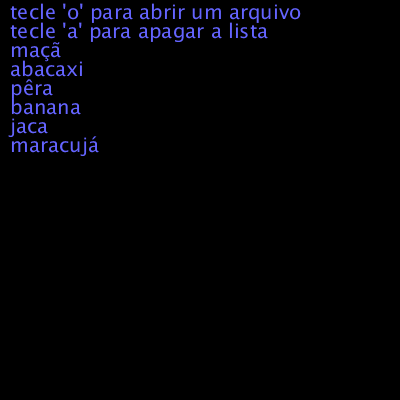

## Lendo e escrevendo texto em arquivos (*file IO*)
### Entrada (*input*) e saída (*output*) de dados em arquivos texto

Nosso primeiro exemplo vai ser sobre como ler linhas de texto (*strings*) de um arquivo texto (*text file*).

O arquivo `frutas.txt` vai ficar dentro da pasta `/data/` dentro  do seu sketch:
```
sketch_2020_05a                (pasta/folder do sketch)
  L  sketch_2020_05a.pyde      (arquivo com o código)
  L  data                      (pasta/folder)
       L  frutas.txt           (arquivo texto)
```
Conteúdo do aquivo:
```
maçã
abacaxi
pêra
banana
jaca
maracujá
```
A leitura dos dos dados pode ser feita no Python de maneira mais 'universal', o que é útil saber para poder fazer em outros contextos de uso de Python:

```python
# No Python - exemplo mais universal
from codecs import open # para poder usar unicode="utf-8" no Python 2 
with open("data/frutas.txt", "r", encoding="utf-8") as file:
    linhas = file.readlines()
```
Ou usando uma função bem simples do Processing chamada `loadStrings()`:

```python
# No Processing - mais específico - não use antes do setup()!
linhas = loadStrings("nomes.txt")  # frutas.txt na pasta /data/
```
Note que em ambos os casos, ler dados de um arquivo no computador é considerada uma operação relativamente lenta e não deve ser feita repetidas vezes dentro do `draw()` pois vai ser um disperdício e deixa o seu desenho ou animação lentos.

```python
def setup():
    size(400, 400)
    background(0)
    # frutas.txt na pasta /data/
    linhas = loadStrings("frutas.txt")  

    fill(100, 100, 255)
    textAlign(CENTER, CENTER)
    textSize(24)
    for linha in linhas:
        x, y = random(40, 360), random(20, 380)             
        text(linha, x, y)    
```


### Escolhendo um arquivo para abrir

Usando o a função `selectInput()`,  você permite que a pessoa escolha um arquivo para subsequente leitura, como no exemplo anterior, com `loadStrings()`. É preciso passar dois argumentos: um texto para o título da janela de seleção, e o nome de uma função que será executada quano a pessoa terminar de selecionar o arquivo (ou cancelar a seleção). 

```python
linhas = ["tecle 'o' para abrir um arquivo",
          "tecle 'a' para apagar a lista",
         ]

def setup():
    size(400, 400)

def draw():
    background(0)
    fill(100, 100, 255)
    textAlign(LEFT, TOP)
    textSize(20)
    for i, linha in enumerate(linhas):
        x = 10 + 120 * (i // 20)
        y = i * 19 - 380 * (i // 20)            
        text(linha, x, y) 
        
def keyPressed():
    if key == 'o':
        selectInput("escolha um arquivo:", "file_selected")
    if key == 'a':
        linhas[:] = []
    if key == 's':
        saveFrame("select_input.png")
        
def file_selected(selection):
    if selection == None:
        print(u"Seleção cancelada.")
    else:
        path = selection.getAbsolutePath()
        print("Arquivo selecionado: " + path)
        linhas.extend(loadStrings(path))         
```



### Escrevendo texto em arquivos (e escolhendo onde salvar um arquivo)

De maneira análoga, podemos usar `saveStrings()` para salvar em um arquivo do disco uma lista de *strings*. No exemplo abaixo usamos `selectOutput()` para disparar uma janela que pergunta o nome e local para salvar um arquivo.

```python
circulos = []

def setup():
    size(400, 400)
    fill(100, 100, 255)
    println(u"Tecle 'W' para gravar e 'L' para carregar dados de um arquivo texto")

def draw():    
    background(0)
    for circulo in circulos:
        x, y, tamanho = circulo
        ellipse(x, y, tamanho, tamanho)

def mouseDragged():
    circulo = (mouseX, mouseY, random(20, 40))
    circulos.append(circulo)

def keyPressed():
    if key =='w' or key == 'W':
        selectOutput("Salvar como:", "salvar_circulos")   # Argumentos: título, função chamada na conclusão           
    if key == 'l' or key == 'L':
        selectInput("Escolha um arquivo:", "carregar_circulos")      
    if key == ' ':
        circulos[:] = []

def salvar_circulos(arquivo):
    if arquivo == None:
        print("Gravação cancelada.")
    else:
        caminho_arquivo = arquivo.getAbsolutePath()
        if not caminho_arquivo.endswith('.txt'):
            caminho_arquivo += '.txt'
        linhas = []
        for circulo in circulos:
                x, y, tamanho = circulo
                linhas.append(u'{} {} {}'.format(x, y, tamanho))            
        saveStrings(caminho_arquivo, linhas)    

def carregar_circulos(arquivo):
    if arquivo == None:
        print(u"Seleção cancelada.")
    else:
        caminho_arquivo = arquivo.getAbsolutePath()
        print("Arquivo selecionado: " + caminho_arquivo)
        linhas = loadStrings(caminho_arquivo)
        for linha in linhas:
            str_x, str_y, str_tamanho = linha.split()
            circulo = float(str_x), float(str_y), float(str_tamanho)
            circulos.append(circulo)                                                              
```


Veja um trecho do arquivo gerado pelo exemplo [`output.txt`](assets/output.txt)
```
68 120 37.5507659912
71 98 32.7605819702
78 83 26.2493400574
84 71 36.1811676025
87 63 35.6623039246
89 59 37.2014465332
90 56 37.5425949097
91 56 23.1710891724
93 55 34.2703857422
98 50 31.6832389832
103 47 33.4321708679
...
```
#### Escrevendo em arquivos no Python sem a ajuda do Processing

A maneira mais 'universal' em Python de se escrever em um arquivo texto é usando `open(caminho_arquivo, modo)`, que fornece um objeto com o método `.write()`.

O mais recomendado é usar um chamado 'gerenciador de contexto', fazendo um bloco indentado que começa com `with open(caminho_arquivo, modo) as objeto_arquivo:`. Se não usar o `with open(... :` você precisa cuidar de 'fechar' o aquivo com `.close()` depois de ler ou escrever, e ainda corre o risco do arquivo ficar aberto se o seu programa encerrar no meio do caminho.

Veja o caso de gravar os dados dos círculos no exemplo anterior como ficaria:

```
from codecs import open # para poder usar unicode="utf-8" no Python 2 
with open(caminho_arquivo, "w", encoding="utf-8") as file:
    for circulo in circulos:
        x, y, tamanho = circulo
        file.write(u'{} {} {}'.format(x, y, tamanho))
 ```       

### Assuntos relacionados

* [Textos no programa, no console e na tela (*strings*)](strings_py.md)
* Se quiser ler mais sobre *Filie IO* na documentação do Python: [Python 2.7 Tutorial: Reading and Writing Files](https://docs.python.org/2/tutorial/inputoutput.html#reading-and-writing-files)        

