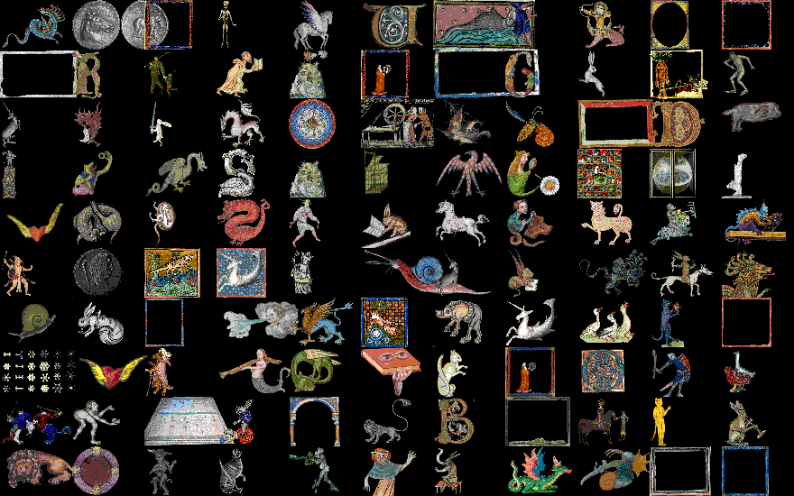

## Lendo todas as imagens de uma pasta



Tendo visto previamente como  [uasr imagens externas](imagens_externas.md) com `loadImage()` neste exemplo mais avançado vamos permitir que a pessoa escolha uma pasta e o *sketch* vai carregar todas as imagens nela encontradas.

A seleção da pasta começa quando se tecla 'o' e a função `selectFolder()` é chamada. 

```python
def keyPressed():
    if key == 'o':
        selectFolder("Selecine uma pasta:", "adicionar_imagens")
```
Note que o primeiro argumento de `selectFolder()` é o texto que vai como título da janela de seleção, o segundo `"adicionar_imagens"` é um *string* do nome de uma função que será chamada quando a pessoa terminar de interagir com a janela de seleção de pasta (diretório / *folder*), seja escolhendo uma pasta seja cancelando. Veja a definição da função `adicionar_imagens()`:

```python
def adicionar_imagens(selection):
    if selection == None:
        print("Seleção cancelada.")
    else:
        dir_path = selection.getAbsolutePath()
        print("Pasta selecionada: " + dir_path)
        for img_name, img_file in list_images(dir_path):
            img = loadImage(img_file)
            print("imagem " + img_name + " carregada.")
            imagens.append((img_name, img))
        print('Número de imagens: ' + str(len(imagens)))
```

Note que o código que cuida da janela do sistema operacional (para escolhermos a pasta) e esta função chamada em seguida, são executados em uma *thread* separada, e por conta disso não interrompe am repetida execução de `draw()`. Como o carregamento das imagens é um procedimento razoavelmente lento é possível vê-las aparecendo aos poucos na tela, conforme são acrescentadas na lista global `imagens`.


 `
Aqui o código completo do sketch:

```python

from __future__ import unicode_literals , division

imagens = []
w, h = 77, 55

def setup():
    global colunas, linhas
    size(770, 550)
    colunas, linhas = width // w, height // h
    print('Posições na grade: ' + str(colunas * linhas))
    
def draw():
    background(0)
    contador = 0
    for c in range(colunas):
        x = c * w
        for l in range(linhas):
            y = l * h
            if contador < len(imagens):
                img = imagens[contador][1]
                fator = h / img.height
                image(img, x, y, img.width * fator, img.height * fator)
                contador += 1
    
def keyPressed():
    if key == 'o':
        selectFolder("Selecine uma pasta:", "adicionar_imagens")
    if key == ' ':
        imagens[:] = []
    if key == 'p':
        saveFrame('####.png')

def adicionar_imagens(selection):
    if selection == None:
        print("Seleção cancelada.")
    else:
        dir_path = selection.getAbsolutePath()
        print("Pasta selecionada: " + dir_path)
        for img_name, img_file in list_images(dir_path):
            img = loadImage(img_file)
            print("imagem " + img_name + " carregada.")
            imagens.append((img_name, img))
        print('Número de imagens: ' + str(len(imagens)))


def list_images(dir=None):
    """
    Devolve uma a lista de tuplas com os nomes dos arquivos de imagem sem extensão e os
    caminhos completos para cada uma das images na pasta `dir` ou na pasta /data/ do sketch.
    Requer a função imgext() para decidir quais extensões aceitar.
    """
    from os import listdir
    from os.path import isfile, join
    data_path = dir or sketchPath('data')
    try:
        f_list = [(f.split('.')[0], join(data_path, f)) for f in listdir(data_path)
                  if isfile(join(data_path, f))
                  and imgext(f)]
    except Exception as e:
        print("Erro ({0}): {1}".format(e.errno, e.strerror))
        return []
    # print f_list
    return f_list

def imgext(file_name):
    extensions = ('.jpg',
                  '.png',
                  '.jpeg',
                  '.gif',
                  '.tif',
                  '.tga',
                  )
    for ext in extensions:
        if file_name.endswith(ext):
            return True
    return False
```

## Assuntos relacionados

- Estrutura de pixels das imagens em [Pixels e imagens](pixels.md)
- [Lendo e escrevendo texto em arquivos (*file IO*)](/Processing-Python/file_IO.md)
