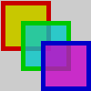
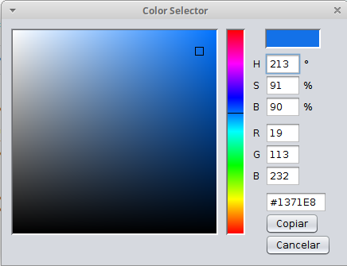

## Mais sobre cores

Vamos falar aqui sobre como definir e manipular as cores, fingindo que podemos definí-las pelas emissões de frequências das 'luzinhas' no monitor ou no projetor que vai mostrar nosso trabalho, mas a verdade é de que a síntese final da cor acontece em um lugar escuro e úmido, o cérebro. A percepção de cor no final das contas depende do contexto em que ela se apresenta, um pixel que em teoria emite uma determinada cor vai ser entendido como outra dependendo do resto da imagem em volta. Se quiser ler mais sobre isso, procure sobre a neurociência da percepção das cores.

### Definindo cores com RGB (ou RGBA)

Por padrão escolhemos cores no Processing com trincas de números entre 0 e 255 que representam valores de intensidade nos canais R (*Red*, vermelho), G (*Green*, verde) e B (*Blue*, azul). Um quarto número (*Alpha*) pode ser usado para indicar cores translúcidas (0 fica totalmente transparente, e invisível, e 255 totalmente opaca, como se não tivesse sido usado o quarto número).

```python
strokeWeight(5)
stroke(200, 0, 0)  # traço vermelho
fill(200, 200, 0)  # preenchimento amarelo
rect(3, 3, 50, 50)

stroke(0, 200, 0)       # traço verde
fill(0, 200, 200, 200)  # preenchimento ciano tranlúcido
rect(25, 25, 50, 50)

stroke(0, 0, 200)       # traço azul
fill(200, 0, 200, 200)  # preenchimento magenta translúcido
rect(47, 47, 50, 50)
```


Uma maneira de escolher uma cor e obter os valores RGB dela é usando a ferramenta no menu do IDE, **Ferramentas > Selector de côr** (*Tools > Color Selector...*).



### Cores com HSB (Matiz, Saturação e Brilho)

Se chamaramos a função *colorMode* com a constante **HSB**, `colorMode(HSB)`, podemos passar a usar números representando Matiz (*Hue*), Saturação (*Saturation*) e Brilho (*Brightness*). É possível reverter pra o modo **RGB** chamando `colorMode(RGB)`.

```python
colorMode(HSB)
# fila de linhas saturadas
for x in range(100):
    stroke(x * 2.5, 255, 255)
    line(x, 0, x, 33)
# fila de linhas com saturação reduzida
for x in range(100):
    stroke(x * 2.5, 128, 255)
    line(x, 33, x, 66)
# fila de linhas com brilho reduzido
for x in range(100):
    stroke(x * 2.5, 255, 128)
    line(x, 66, x, 100)
```


