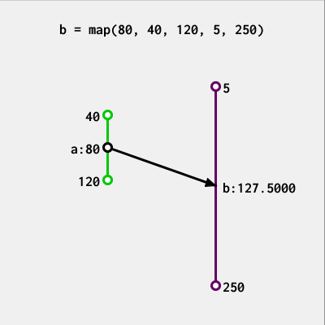
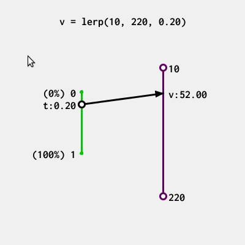
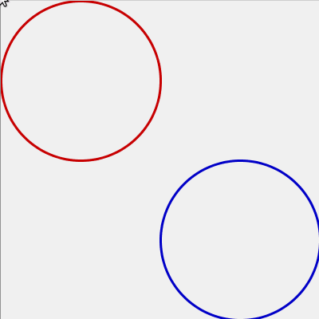

# Manipulando números com `map()` e `lerp()`

## Sumário

[Função `map()`](#a-função-map-do-processing)
[Função `lerp()`](#a-função-lerp)
[Função `lerpColor()`](#lerp-para-cores)

### A função `map()` do Processing

> No Processing modo Python temos uma situação um pouco curiosa, por ser uma ferramenta híbrida com elementos de Processing e de Python. Essas duas linguagens tem funções de nome `map()` mas com comportamentos/significados totalmente distintos. Nesta página vamos explorar o comportamento do `map()` do Processing (mas é possível obter o comportamento de `map()` do Python também, que explicaremos em outra página).

A função `map()` converte um valor de uma faixa de números devolvendo um valor equivalente em outra faxia. Recebendo um número, que vamos chamar de **`a`**, que está em uma faixa de origem de `a0`  a `a1` , devolve um número **`b`**  na faixa de destino de `b0` a `b1`, de forma que 'mapeia' valores de uma faixa para outra. A sintaxe fica assim, entregamos 5 argumentos e obtemos um valor como resposta: 

```python
b = map(a, a0, a1, b0, b1)
```

Veja uma animação que tenta mostrar como funciona essa conversão de valores de uma escala ou faixa para outra.



Note que se você entregar um número **`a`** fora da faixa de origem indicada (entre `a0` e `a1`) vai receber um número 'para fora' da faixa de destino entre `b0` e `b1`.

Em um caso de uso bem simples, o `map()` podemos transformar o valor da posição horizontal do mouse, `mouseX`, que é um número entre **0** e a largura da área de desenho (`width`), em um valor para controlar elementos do desenho (na faixa que desejarmos).  No exemplo abaixo, cinzas entre preto e branco podem são criados com números na faixa entre **0** e **255**, e um círculo vai ser movido entre as posições **x**  de **100** a **300**.

```python
def setup():
    size(400, 400)
    strokeWe
    
def draw():
    background(200)
    
    cinza = map(mouseX, 0, width, 0, 255)
    x = map(mouseX, 0, width, 100, 300)
    
    fill(cinza)
    circle(x, height / 2, 100)
```


### A função `lerp()`

O nome vem, de  <i>**l**inear int**erp**olation</i> (interpolação linear) e a função permite obter um número intermediário ente do outros números `v0` e `v1` de maneira proporcional a um parâmetro **`t`**. Você pode interpretar **`t`** como uma porcentagem, **0** faz `lerp()` devolver o primeiro número, `v0`, e **1**  produz o segundo, `v1`.  Com o **`t`**  valendo  **0.5** (50%) o valor devolvido fica bem no meio do caminho entre os dois números (uma média aritmética).

Isso lembra o `map()` que acabamos de ver, mas com uma faixa de origem (para o **`t`**) predeterminada de  **0** a **1** , veja na animação abaixo.



Note que assim como em `map()` valores fora da faixa esperada de origem (no caso entre **0** e **1**) produzem valores além dos limites fornecidos.


### *Lerp* para cores

Podemos também obter cores intermediárias com a função `lerpColor()` 


Veja exemplos de uso abaixo.

```python
from __future__ import division

def setup():
    size(400, 400) 
    strokeWeight(3)
    noFill()
    
def draw():
    background(240)
    xa, ya = 100, 100
    xb, yb = 300, 300
    ca = color(200, 0, 0)
    cb = color(0, 0, 200)
    n = 1 + int(mouseX / 10) # ou 1 + int(map(mouseX, 0, width, 0, 40))
    for t in range(n + 1):
        xc = lerp(xa, xb, t / n)
        yc = lerp(ya, yb, t / n)
        cc = lerpColor(ca, cb, t / n)
        stroke(cc)    
        ellipse(xc, yc, 200, 200)
```


```python
from __future__ import division

def setup():
    size(400, 400)
    
def draw():
    background(200)
    noStroke()
    dots(width / 2, height / 2,
         mouseX , mouseY,
         color(255, 255, 0),
         color(0, 255, 255), 
         steps=10,
         dot_size=25)
    
def dots(x1, y1, x2, y2, ca, cb, steps=10, dot_size=10):
    L = dist(x1, y1, x2, y2)
    A = atan2(x1 - x2, y2 - y1)
    pushMatrix()
    translate(x1, y1)
    rotate(A)
    if L < steps * dot_size:
        steps = int(L / dot_size)
    for i in range(steps + 1):
        y = 0
        if steps > 0:
            p = i / steps
            y = lerp(0, L, p)
            cor = lerpColor(ca, cb, p) 
            fill(cor)
        rectMode(CENTER)
        rect(0, y, dot_size, dot_size)
    popMatrix()
```

### Assuntos relacionados

- [Transições com *easing*](easing.md)
