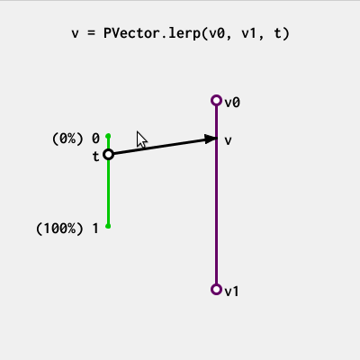
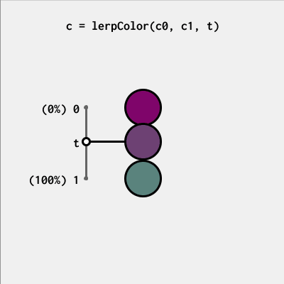

## Funções `map()`, `lerp()` e experimentando *easing*

### A função `map()` do Processing

> No Processing modo Python temos uma situação um pouco curiosa, por ser uma ferramenta híbrida com elementos de Processing e de Python. Essas duas linguagens tem funções de nome `map()` mas com comportamentos/significados totalmente distintos. Nesta página vamos explorar o comportamento do `map()` do Processing (mas é possível obter o comportamento de `map()` do Python também, que explicaremos em outra página).

A função `map()`, requer 5 argumentos e devolve um valor: `b = map(a, a0, a1, b0, b1)`

Ela recebe um número, que vamos chamar de **`a`**, e que está em uma faixa de origem de `a0`  a `a1` , e devolve um número **`b`**  na faixa de destino de `b0` a `b1`, de forma que 'mapeia' valores de uma faixa para outra. 

Veja uma animação que tenta mostrar como funciona essa conversão de valores de uma escala ou faixa para outra.


Note que se você entregar um número **`a`** fora da faixa de origem indicada (entre `a0` e `a1`) vai receber um número 'para fora' da faixa de destino entre `b0` e `b1`.

Em um caso de uso bem simples, o `map()` podemos transformar o valor da posição horizontal do mouse, `mouseX`, que é um número entre **0** e a largura da área de desenho (`width`), em um valor para controlar elementos do desenho (na faixa que desejarmos).  No exemplo abaixo, cinzas entre preto e branco podem são criados com números na faixa entre **0** e **255**, e um círculo vai ser movido entre as posições **x**  de **100** a **300**.


```python
def setup():
    size(400, 400)
    
def draw():
    background(0, 0, 200)
    
    lado = width / 2
    cinza = map(mouseX, 0, width, 0, 255)
    x = map(mouseX, 0, width, 100, 300)
    
    fill(cinza)
    circle(x, height / 2, 100)
```

### A função `lerp()`

O nome vem, de  <i>**l**inear int**erp**olation</i> (interpolação linear) e a função permite obter um número intermediário ente dois números `v0` e `v1` de maneira proporcional a um parâmetro **`t`**. Você pode interpretar **`t`** como uma porcentagem, **0** faz `lerp()` devolver o primeiro número, `v0`, e **1**  produz o segundo, `v1`.  Com o **`t`**  valendo  **0.5** (50%) o valor devolvido fica bem no meio do caminho entre os dois números (uma média aritmética).

Isso lembra o `map()` que acabamos de ver, mas com uma faixa de origem (para o **`t`**) predeterminada de  **0** a **1** , veja na animação abaixo.


Note que assim como em `map()` valores fora da faixa esperada de origem (no caso entre **0** e **1**) produzem valores além dos limites fornecidos.

#### *Lerp* para vetores

É possível fazer a interpolação linear das coordenadas de um ponto, para encontrar pontos intermediários, o mesmo vale para vetores. É comum no Processing usar objetos da classe `PVector` para armazenar pontos e vetores. Essa classe tem um método `lerp()` que pode ser muito útil.



#### *Lerp* para cores

Podemos também obter cores intermediárias com a função `lerpColor()` 



### O que é *easing*?

A ideia por trás de easing é de que na natureza, os movimento tem variação de velocidade que raramente é linear. As funções de *easing* recebem um valor entre **0** e **1**, como `lerp()` que acabamos de ver, e retornam um valor, grosso modo na mesma faixa, o pelo menos nos extremo (podendo passar temporariamente um pouco pra fora). Em geral nessas funçõs **0** devolve **0** e **1** produz **1**, mas a variação intermediária cantece em velocidades diferentes.


