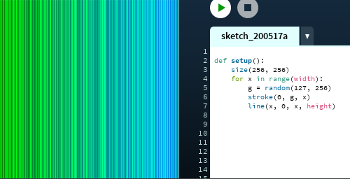
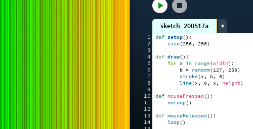

## Parando o `draw()`

O laço principal do Processing é uma função de nome `draw()` que devemos definir quando queremos fazer *sketches*  animados ou interativos, e cujo conteúdo fica sendo repetido. O Processing, normalmente, chama para nós essa função repetidas vezes sem parar. Vejamos alguma estratégias 'alternativas' à repetição continua do `draw()`.

### Um *sketch* sem `draw()`

É possivel trabalhar  com desenhos estáticos sem o `draw()`,  sem `setup()` também para *sketches* muito simples, ou apenas com `setup()` como no exemplo abaixo.

### `draw()` vazio

Para poder usar as funções disparadas por eventos, como `keyPressed()` ou `mousePressed()` é preciso que seja criada uma função `draw()`, mesmo que vazia.  Em Python é possível criar uma função vazia com a palavra chave `pass` no corpo da função, algo como 'passar a vez em um jogo'. Veja abaixo um exemplo com a função `mouseMoved()`.

### `noLoop()` e `loop()`

Mesmo com o desenho sendo feito dentro de `draw()`, como de costume, é possível fazer com que a função pare de repetir, invocando `noLoop()`.  Isso pode ser feito já no `setup()`, dentro do próprio `draw()` ou em alguma função disparada por um evento. Já a função `loop()`que faz o `draw()` voltar  a ser executado repetidas vezes, tem que ser invocado em alguma função disparada por um evento, como no exemplo abaixo em `mouseReleased()`. 

> `draw()` para quando um botão do mouse é apertado e volta a *loopar* quando é solto.

