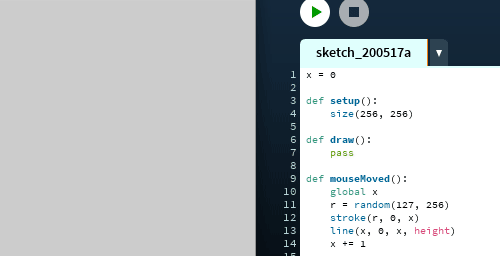
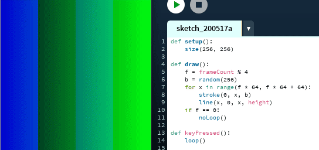
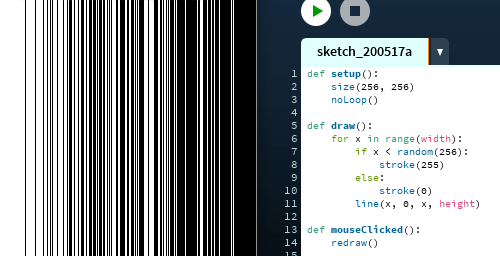

## Parando o `draw()`

O laço principal do Processing é uma função de nome `draw()` que devemos definir quando queremos fazer *sketches*  animados ou interativos, e cujo conteúdo fica sendo repetido. O Processing, normalmente, chama para nós essa função sem parar, cada ciclo é um *frame* (quadro de uma animação). Vejamos alguma estratégias 'alternativas' à repetição continua do `draw()`.

### Um *sketch* sem `draw()`

É possível trabalhar  com desenhos estáticos sem o `draw()`,  sem `setup()` também para *sketches* muito simples, ou apenas com `setup()` como no exemplo abaixo.

### Um corpo de`draw()` vazio

Para poder usar as funções disparadas por eventos, como `keyPressed()` ou `mousePressed()` é preciso que seja criada uma função `draw()`, mesmo que vazia.  Em Python é possível criar uma função vazia com a palavra chave `pass` no corpo da função, algo como 'passar a vez em um jogo'. Veja abaixo um exemplo com a função `mouseMoved()`.

> Nada é desenhado até que o evento do movimento do mouse dispare a função `mouseMoved()` que desenha as linhas.

### Usando `noLoop()` e `loop()`

Mesmo com o desenho sendo feito dentro de `draw()`, como de costume, é possível fazer com que a função pare de repetir, invocando `noLoop()`.  Isso pode ser feito no `setup()`, dentro do próprio `draw()` ou em alguma função disparada por evento. Já a função `loop()`, que faz o `draw()` voltar  a ser executado repetidas vezes, tem que ser invocada dentro de alguma função disparada por evento, como`mouseReleased()` no exemplo abaixo.

> `draw()` para quando um botão do mouse é apertado e volta a repetir quando é solto.

Neste  exemplo a função `draw()` é executada 4 vezes e para, chamando `noLoop()`, se alguma tecla for apertada, `loop()` é executada dentro de `keyPressed()` e temos mais 4 execuções de `draw()`.

> Cada vez que uma tecla é pressionada, `draw()` é executada 4 vezes.

O operador `%` é usado para obter o resto da divisão do número do frame (`frameCount`) por 4 . Veja como são os resultados:

| frameCount | % 4 (resto da divisão por 4) |
| ---------- | ---------------------------- |
| 1          | 1                            |
| 2          | 2                            |
| 3          | 3                            |
| 4          | 0                            |
| 5          | 1                            |
| 6          | 2                            |
| 7          | 3                            |
| 8          | 0                            |
| ...        | ...                          |

### A função `redraw()`

Por fim vejamos a função `redraw()`, que quando  usada, marca para que seja executado um único *frame* de `draw()`. No exemplo abaixo, a repetição de `draw()` está pausada por conta de `noLoop()` em `setup()`.

> Um novo ciclo de `draw()` é executado quando o mouse for clicado.

