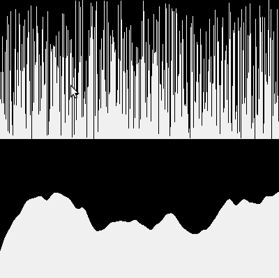
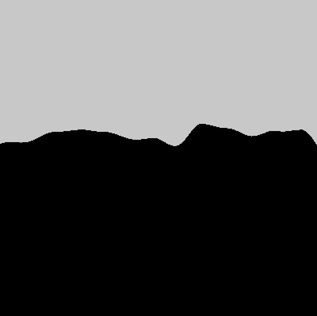
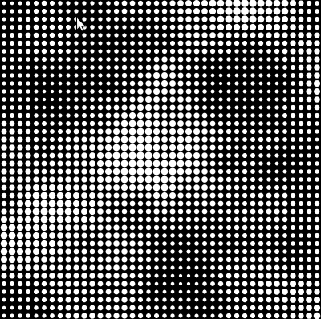
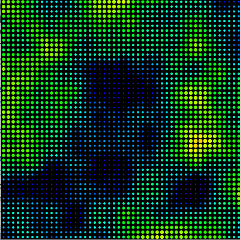
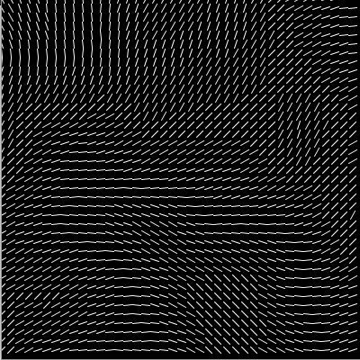

## *Perlin noise*
#### Ruído de Perlin

><i>An algorithm known as “Perlin noise,” named for its inventor Ken Perlin, takes this concept into account. Perlin developed the noise function while working on the original Tron movie in the early 1980s; it was designed to create procedural textures for computer-generated effects. In 1997 Perlin won an Academy Award in technical achievement for this work. Perlin noise can be used to generate various effects with natural qualities, such as clouds, landscapes, and patterned textures like marble.
>
>Perlin noise has a more organic appearance because it produces a naturally ordered (“smooth”) sequence of pseudo-random numbers. The graph on the left below shows Perlin noise over time, with the x-axis representing time; note the smoothness of the curve.</i> SHIFFMAN, Daniel,[*The Nature of Code*](https://natureofcode.com/book/introduction/), 2012.

### *Perlin Noise* 1D

O primeiro exemplo de Ruído de Perlin usa essa função embutida do Processing chamada `noise()`, e  que gera um número entre **0** e **1**, inicialmente com apenas um argumento. Vamos comparar o resultado com `random(1)` na parte de cima da àrea de desenho. Note que na parte de baixo, com `noise()` os valores produzidos tem relação com os vizinhos, ao contrário do `random()`, produzindo uma curva relativamente suave. A amplitude pode ser ajustada mudando o valor pelo qual multiplicamos o resultado de `noise()`, ou então, usando `lerp()`.

Pense no argumento que usamos na chamada de `noise()` como um X que deslocamos em uma certa *velocidade*, normalmente chamada de *escala* do ruído. Podemos experimentar mudar a variável `escala`, no exemplo abaixo, e que multiplica os passos dados no argumento de entrada, ou ainda deslocar esse X uma certa distância arbitraria. Os resultados de `noise()` são simétricos para valores negativos de X. 

```python
escala = 0.01
desloca_x = 0

def setup():
    size(400, 400)   

def draw():   
    background(240)  
    randomSeed(1001)  # para 'travar' o random() 
    for x in range(width):
        y = random(height/2)
        line(x, 0, x, y)
        
    for x in range(width):
        n = noise((desloca_x + x) * escala)
        y = lerp(height / 2, height, n)
        # y = height / 2 + (height / 2) * n
        line(x, height / 2, x, y)
        
def keyPressed():
    global escala, desloca_x
    if key == 'a':
        escala += 0.001
    if key == 'z':
        escala -= 0.001         
    if key == 's':
        desloca_x += 5
    if key == 'x':
        desloca_x -= 5 
```



Com o teclado estamos alterando o valor da escala e do deslocamente em X.

Note que não é necessário usar `noiseSeed()` no `draw()` pois a semente do `noise()` é inicializada no início da execução do *sketch* e os valores obtidos são consultados por meio dos argumentos, deternísticos, calculados, como posições a serem consultadas em um 'campo' fixo.

### *Perlin Noise* em 2D, acrescentando um Y

Agora acrescentaremos uma segunda dimensão, um Y, que serve de segundo argumento na função `noise()`. Ambos X e Y são multiplicados pela escala, e, no exemplo abaixo, serão deslocados pela posição do mouse.
        
Com essa segunda dimensão, perpendicular à primeira, é como se estivéssemos movendo o corte de um terreno. O `mouseY` move o corte em uma direção perpendicular à tela, que é paralela ao corte.

```python
escala = 0.004

def setup():
    size(400, 400)
    
def draw():
    background(200)
    for x in range(width):
        n = noise((mouseX + x) * escala,
                  mouseY * escala)
        y = height * n
        line(x, height, x, height - y)
```



#### *Perlin Noise* em uma grade 2D

Uma segunda maneira de usar o ruído de Perlin é distribuindo os valores em uma grade, de maneira que as coordenadas no plano da tela informam os passos tanto em X como em Y.

```python
escala = 0.01
desloca_x = 100
desloca_y = 100
tam = 10

def setup():
    size(400, 400)   
    noStroke()
    
def draw():   
    background(0)          
    for x in range(0, width, tam):
        for y in range(0, height, tam):
            n = noise((desloca_x + x) * escala,
                      (desloca_y + y) * escala)
            ellipse(tam / 2 + x,
                    tam / 2 + y,
                    2 + tam * n,
                    2 + tam * n)
        
def keyPressed():
    global escala, desloca_x, desloca_y
    if key == 'a':
        escala += 0.001
    if key == 'z':
        escala -= 0.001         
    if keyCode == LEFT:
        desloca_x += 5
    if keyCode == RIGHT:
        desloca_x -= 5         
    if keyCode == UP:
        desloca_y += 5
    if keyCode == DOWN:
        desloca_y -= 5   
```


### *Perlin Noise* 3D, acrescentando um Z

Este é um exemplo de Ruído de Perlin com três dimensões. O mouse desloca o campo em X e Y, as setas para cima e para baixo deslocam em Z.

```python
escala_noise = 0.1
z = 0

def setup():
    size(400, 400)
    noStroke()
    colorMode(HSB)

def draw():
    background(0)
    cols = 50
    tam = width / cols
    for x in range(cols):
        for y in range(cols):
            n = noise((mouseX + x) * escala_noise, (mouseY + y) * escala_noise, z * escala_noise)
            fill(240 * n, 255, 255)
            ellipse(tam / 2 + x * tam, tam / 2 + y * tam,
                    tam - tam * n, tam - tam * n)
            
def keyPressed():
    global z
    if keyCode == UP:
        z +=1
    if keyCode == DOWN:
        z -=1
```



##### Campo "vetorial" de ruído

Um campo em que o valor do ruído Perlin gira um ângulo.

```python
escala = 0.003
z = 0 
def setup():
    size(400, 400)
    stroke(255)
    
def draw():
    background(0)
    for x in range(0, width, 10):
        for y in range(0, height, 10):
            n = noise((mouseX + x) * escala,
                     (mouseY + y) * escala,
                     z * escala)
            pushMatrix()
            translate(x, y)
            rotate(TWO_PI * n)
            line(-5, 0, 5, 0)
            popMatrix()
        
def keyPressed():
    global z
    if keyCode == UP:
        z +=1
    if keyCode == DOWN:
        z -=1
```

