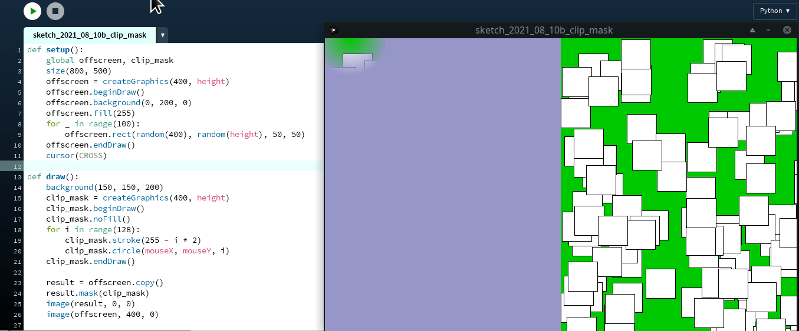

## Desenhando em um espaço fora da tela (*offscreen buffer*)

É possível desenhar em um objeto especial, uma espécie de tela virtual, criando superfícies *PGraphics* com a função [createGraphics()](https://py.processing.org/reference/createGraphics.html), em vez de desenhar diretamente na tela em uma estratégia conhecida como _offscreen buffer_. Depois é possível mostrar ou não essa imagem na área de desenho normal com a função `image()` (a mesma que usamos para mostrar uma imagem externa carregada carregada com `loadImage()`, uma *PImage*).

**Atenção:** Não esqueça de usar `.beginDraw()` e `.endDraw()` ou você será brindado com uma `NullPointerException`

Algumas vantagens dessa estratégia podem ser:
- Desenho cumulativo em uma camada enquanto se anima elementos (com limpeza do frame) em outra camada;
- Potencialmente mais rápido do que desenhar na tela (reaproveitando um desenho com partes já prontas, por exemplo);
- Salvar o imagens em camadas separadas para posterior tratamento.
- Aplicação de máscaras de recorte ou outros tratamentos

### Camadas que podem ser salvas em separado

```python
def setup():
    size(600, 400)
    
def draw():
    global c0, c1
    # camada 0
    c0 = createGraphics(600, 400)
    c0.beginDraw()
    # c0.background(200) # fundo (opaco)
    c0.clear() # limpa os pixels, deixa transparente
    c0.fill(255, 0, 0)
    c0.rect(100, 100, 100, 100)
    c0.endDraw()
    # camada 1
    c1 = createGraphics(600, 400)
    c1.beginDraw()
    c1.clear() # limpa os pixels, deixa transparente
    c1.fill(0, 0, 200)
    c1.ellipse(200, 200, 200, 200)
    c1.endDraw()
    # desenhe as camandas na tela
    image(c0, 0, 0)
    image(c1, 0, 0)
                    
def keyPressed():
    if key == 's':
        c0.save('camada0.png')
        c1.save('camada1.png')
        saveFrame("camadas-combinadas.png")
```


### Recortando imagens com uma máscara



```python
def setup():
    global offscreen, clip_mask
    size(800, 500)
    # vamos usar uma área de desenho fora da tela "offscreen buffer"
    offscreen = createGraphics(400, height) 
    offscreen.beginDraw()  # necessário antes de desenhar na área
    offscreen.background(0, 200, 0)
    offscreen.fill(255)  
    for _ in range(100):
        offscreen.rect(random(400), random(height), 50, 50)
    offscreen.endDraw() # também é preciso encerrar o desenho
    cursor(CROSS)  # cursor em cruz
                                         
def draw():
    background(150, 150, 200)
    # Uma outra área de desenho que vai ser uma máscara de recorte:  Regiões
    # brancas na máscara indicam posiçoes da imagem final que são mostradas,
    # regiões pretas serão ocultadas e as cinzas intermediárias mostradas translúcidas
    clip_mask = createGraphics(400, height)
    clip_mask.beginDraw()   
    clip_mask.noFill()  # usaremos círculos vazados
    for i in range(128):
        clip_mask.stroke(255 - i * 2)  # cor de traço variável
        clip_mask.circle(mouseX, mouseY, i)    
    clip_mask.endDraw() 
 
    result = offscreen.copy()  # uma cópia da imagem original
    result.mask(clip_mask)     # esta operação modifica a imagem
    image(result, 0, 0)        # mostra a imagem modificada
    image(offscreen, 400, 0)   # mostra a imagem original
    
```

### Exemplo avançado de máscara
```python
def setup():
    global offscreen, clip_mask
    size(500, 500)
    offscreen = createGraphics(width, height)
    offscreen.beginDraw()
    offscreen.clear() # fundo transparente
    # offscreen.background(0, 200, 0, 100)  # é possível fundo translúcido
    offscreen.fill(255, 0, 0, 128)  # vermelho translúcido
    for _ in range(100):
        offscreen.rect(random(width), random(height), 50, 50)
    offscreen.endDraw()
                                         
def draw():
    background(150, 150, 200)
    y = frameCount % height
    line(0, y, width, y)
    
    clip_mask = createGraphics(width, height)
    clip_mask.beginDraw()   
    clip_mask.fill(255)
    clip_mask.circle(mouseX, mouseY, 250)    
    clip_mask.endDraw()
 
    result = offscreen.copy()
    # sem o mouse apertado é mais rápido (desconsidera alpha da imagem original)
    if mousePressed:
        result.mask(min_alphas(offscreen, clip_mask))
    else:
        result.mask(clip_mask) # máscara normal
    image(result, 0, 0)  # desenha na tela a imagem com a máscara aplicada
 
def min_alphas(img1, img2):
    """Devolve pixels com alfa do mais transparente de cada par de pixels"""
    img1.loadPixels()
    img2.loadPixels()
    return [min(pix1 >> 24 & 0xFF, pix2 >> 24 & 0xFF) # dark magic, don't ask
            for pix1, pix2 in zip(img1.pixels, img2.pixels)]
    
``` 


