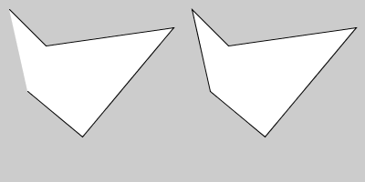

# Desenhando polígonos - I
### primeiro contato

Processing oferece funções para desenhar triângulos `triangle()` e quadriláteros `quad()`, 3 e 4 pares de números, coordenadas para 3 e 4 vértices, respectivamente, como no exemplo a seguir:


Mas e se quisermos desenhar um polígono com um número arbitrário de vértices?

Neste caso usaremos um conjuto de funções, começando com `beguinShape()`, seguido de um número de vezes da função `vertex()` para cada vértice, terminando com `endShape()`. Quando usado com a constante `CLOSE`, `endShape(CLOSE)`, produz polígonos fechados.

```pyde
beginShape()  # inicia o polígono da esquerda
vertex(10, 10)
vertex(50, 50)
vertex(190, 30)
vertex(90, 150)
vertex(30, 100)
endShape()  # polígono aberto

beginShape()  # inicia o polígono da direita
vertex(210, 10)
vertex(250, 50)
vertex(390, 30)
vertex(290, 150)
vertex(230, 100)
endShape(CLOSE)  # polígono fechado
```


### Desenhando uma estrela de quatro pontas


```pyde
def setup():
    size(200, 200)
    
def draw():    
    x, y = 100, 100  # coordenadas do centro
    largura_total, largura_menor = 150, 100
    mm, m = largura_total / 2, largura_menor / 2
    beginShape()
    vertex(x - mm, y - mm)
    vertex(x - m, y)
    vertex(x - mm, y + mm)
    vertex(x, y + m)
    vertex(x + mm, y + mm)
    vertex(x + m, y)
    vertex(x + mm, y - mm)
    vertex(x, y - m)
    endShape(CLOSE)
```
