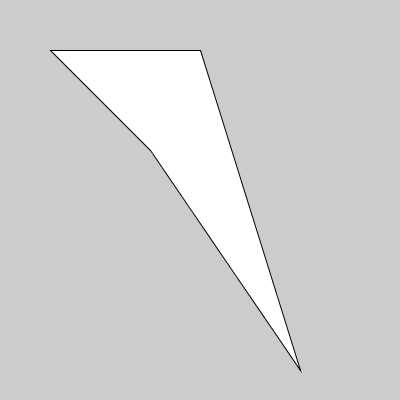

# Desanhando polígonos - II
### mais sobre polígonos

Agora que já sabemos iterar por uma estrutura de dados, podemos usar as coordenadas das tuplas na lista que vimos anteriormente para desenhar um polígono:

```pyde
def setup():
    size(400, 400)
    
    pontos = [(50, 50), (300, 370), (200, 50), (150, 150)]
    beginShape()
    for x, y in pontos:
        vertex(x, y)
    endShape(CLOSE)
```



Podemos inclusive encapsular e uma função a o desenho do polígono:

```pyde
def poly(sequencia):
    beginShape()
    for x, y in sequencia:
        vertex(x, y)
    endShape(CLOSE)
``` 
    
<details>    
<summary>Uma versão mais completa da função que desenha polígonos.</summary>

```pyde
def poly(points, closed=True):
    """
    Aceita uma sequencia de tuplas ou vetores
    tanto com (x, y) como com (x, y, z)
    por default faz um polígono fechado
    """
    beginShape()
    for p in points:
        if len(p) == 2 or p[2] == 0:
            vertex(p[0], p[1])
        else:
            vertex(*p)  # desempacota pontos em 3d
    if closed:
        endShape(CLOSE)
    else:
        endShape()
```        
</details>        

    
