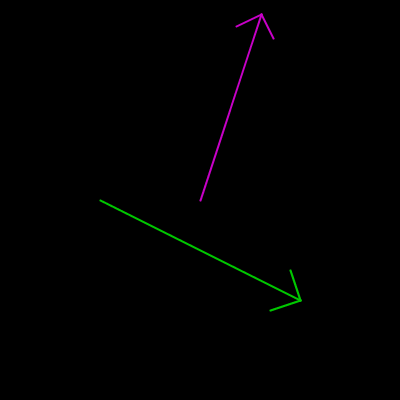

## Um pouco de ângulos, com seno, cosseno e arco tangente

### `sin()`, `cos()` e `atan2()`

As funções trigonométricas não são nenhum bicho de sete cabeças,  2 cabeças, no máximo...

Para começar é preciso saber que quando elas pedem um ângulo como argumento. elas esperam que você informe esse ângulo em *radianos*, se você pensa em graus, é só usar `radians(angulo_em_graus)` para converter. Algumas como `atan2()` devolvem um ângulo em radianos, que pode ser convertido em graus com `degrees(angulo_em_radianos)`se você precisar.

### Seno e cosseno

Para além da origem dessas funções nas relações matemáticas dos ângulos de um triângulo e de um círculo de raio unitário, das coisas mais úteis que você pode entender facilmente é que essas funções devolvem valores entre **-1** e **1** de maneira cíclica, periódica.

Vamos visualizar aqui em dois exemplos o que isso significa.

#### `sin()` e `cos()` no espaço


```python
def setup():
    size(628, 200)
    background(0)
    translate(0, 100)
    indicacoes() # textos e linha em π
    strokeWeight(2)
    scale(1, -1)  # inverte o Y
    for x in range(width):
        a = x / 100.0
        y_cosseno = cos(a) * 100
        stroke(200, 200, 0)
        point(x, y_cosseno)
        y_seno = sin(a) * 100
        stroke(0, 200, 200)
        point(x, y_seno)

def indicacoes():
    f = createFont('FreeMono Bold', 14)
    textFont(f)
    fill(255)
    text(" 0", 0, 5)
    text("-1", 0, 98)
    text(" 1", 0, -90)
    stroke(255)
    strokeWeight(1)
    line(width / 2.0, -height / 2.0,
         width / 2.0, height / 2.0)
    text(u"π 180°", -14 + width / 2.0,
         10 - height / 2.0)
    fill(200, 200, 0)
    text("cosseno", 10, -70)
    fill(0, 200, 200)
    text("seno", 10, -50)
```

#### `sin()` e `cos()` no tempo


```python
def setup():
    size(628, 200)
    
def draw():
    background(0)
    a = radians(frameCount)
    indicacoes()
    tam_cosseno = 100 + cos(a) * 100
    fill(200, 200, 0)
    ellipse(width / 3, height / 2,
            tam_cosseno, tam_cosseno)
    tam_seno = 100 + sin(a) * 100
    fill(0, 200, 200)
    ellipse(2 * width / 3, height / 2,
            tam_seno, tam_seno)

def indicacoes():
    a = frameCount % 360 
    x = radians(a) * 100
    stroke(255)
    line(x, 0, x, height)
    f = createFont('FreeMono Bold', 14)
    textFont(f)
    fill(255)
    noStroke()
    text(u'ângulo: {:0>3}'.format(a), 10, 20)
    fill(200, 200, 0)
    text("cosseno", 10, 40)
    fill(0, 200, 200)
    text("seno", 10, 60)
```


###  A função `atan2()`

#### Como descobrir o ângulo de um segmento de reta?

A função `atan()` (arco tangente) devolve um ângulo a partir da tangente de um ângulo, e é possível calcular a tangente dividindo o cateto oposto pelo cateto adjacente,  os lados paralelos aos eixos, do triângulo formado pelos pontos de uma 'linha' (como chamamos informalmente um segmento de reta definido por dois pontos). 

O cateto oposto é a diferença dos valores de Y e o adjacente a diferença dos valores de X das coordenadas da linha. Só que na prática isso é uma encrenca, se a linha ficar na vertical teremos uma divisão por zero…  Muito mais prático é entregar o trabal

ho de dividir para uma 'versão 2' da função do arco tangente: `atan2(dy, dx)`, os dois argumentos são as medidas dos catetos e ela cuida de tudo nos devolvendo um ângulo em radianos.

 

Note que vamos obter ângulos entre **-π** e **π** (entre **-180** e **180** graus).


#### Desenhando uma seta com `atan2()`

Para demonstrar a utilidade de se saber o ângulo de uma linha, vamos desenhar uma seta!

A estratégia é usar o ângulo para girar o sistema de coordenadas dentro da função da seta  e desenhar a cabeça de maneira mais simples.




```python
def setup():
    size(400, 400)
    strokeWeight(2)
    
def draw():
    background(0)
    stroke(200, 0, 200)
    seta(200, 200, mouseX, mouseY)
    stroke(0, 200, 0)
    seta(100, 200, 300, 300)    

def seta(xa, ya, xb, yb):
    d = dist(xa, ya, xb, yb)
    a = atan2(ya - yb, xa - xb)
    line(xa, ya, xb, yb)
    pushMatrix() 
    translate(xb, yb)
    rotate(a)
    tc = d / 10
    line(0, 0, tc, tc)
    line(0, 0, tc, -tc)
    popMatrix()
```

