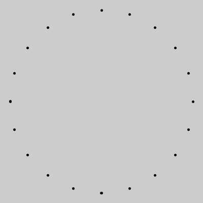
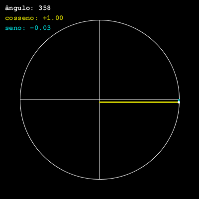

## Um pouco de ângulos, com seno, cosseno e arco tangente

## `sin()`, `cos()` e `atan2()`

As funções trigonométricas não são nenhum bicho de sete cabeças, 2π cabeças, no máximo...

Para começar é preciso saber que quando uma dessas funções pede um ângulo como argumento (o valor entre parênteses), espera que você informe esse ângulo em *radianos*, por isso, se você pensa em graus, use `radians(angulo_em_graus)` para converter. Outras funções, como `atan2()`, que vamos ver nesta página, devolvem um ângulo, em radianos, que por sua vez pode ser convertido em graus com `degrees(angulo_em_radianos)`se você precisar.

#### Sumário
- [seno e cosseno](#seno-e-cosseno)
- [`sin()` e `cos()` no espaço](#sin-e-cos-no-espaço)
    - [outra versão com algumas indicações](#outra-versão-com-algumas-indicações)
- [`sin()` e `cos()` no tempo](#sin-e-cos-no-tempo)    
- [Seno e cosseno fornecem as coordenadas dos pontos de um círculo!](#seno-e-cosseno-fornecem-as-coordenadas-dos-pontos-de-um-círculo)
    - [Uma versão animada e com algumas indicações](#uma-versão-animada-e-com-algumas-indicações)
- [A função do arco tangente](#a-função-do-arco-tangente)
    - [Como descobrir a inclinação de um segmento de reta?](#como-descobrir-a-inclinação-de-um-segmento-de-reta)
    - [Desenhando uma seta com `atan2()`](#desenhando-uma-seta-com-atan2)
    - [Apontando para o mouse](#apontando-para-o-mouse)

### Seno e cosseno

Na origem essas funções tratam das relações entre ângulos e proporções das medidas dos triângulos, sendo muito estudas, demonstradas, em triângulos retângulos ou em um círculo de raio unitário (o ciclo trigronométrico), mas para além desse contexto, das coisas mais úteis que você pode querer saber, e acredito não ser difícil demonstrar aqui, é que essas funções devolvem valores entre **-1** e **1** de maneira cíclica, periódica.

Os primeiros exemplos a seguir são para visualizar como se dá o comportamento do seno e do cosseno.

#### `sin()` e `cos()` no espaço


Para produzir a imagem acima, criamos um laço repetição que produz um `x` de **0** a **720** , convertemos esse `x`num ângulo em radianos e dividimos por **2**, de forma a obter ângulos de **0** a **2π** radianos (ou **0°** a **360°**). 

Vamos  multiplicar o valor do seno e do cosseno do ângulo pela metade da altura da tela (aproveitando para inverter o sinal pois o eixo Y do Processing cresce para baixo e estamos acostumados a ver os gráficos com a parte positiva para cima). Para deslocar a origem para baixo somamos esse mesmo valor de metade da altura da tela.

```python
size(720, 229)  # 360×2, 4 radianos
for x in range(width):
    meia_altura = height / 2  
    ang = radians(x / 2.0)  # 720 pixels -> 360 graus
    seno = sin(ang) * -meia_altura + meia_altura        
    point(x, seno)
    cosseno = cos(ang) * -meia_altura + meia_altura
    point(x, cosseno)
```

Qual é o seno e qual o cosseno? Veja o resultado das instruções a seguir.

```python
print(sin(0))  # exibe no console: 0.0
print(cos(0))  # exibe no console: 1.0
```

O seno é o que começa à esquerda no **0**, na meia altura da tela, e o cosseno é o que começa no alto valendo **1**.

##### Outra versão com algumas indicações

Desta vez o exemplo usa `translate()` e `scale()` para deslocar e inverter o eixo Y. E o X vai de **0** a aproximadamente **2π** mutiplicado por **100**


```python
def setup():
    size(628, 200)  # malandrangem 2π×100, 2×100 
    textFont(createFont('FreeMono Bold', 14))
    background(0)
    translate(0, 100) # desloca o Y meia tela
    indicacoes()  # desenha textos e linha em π
    
    strokeWeight(2)
    scale(1, -1)  # inverte o Y
    for x in range(width):
        a = x / 100.0  # width ~2π×100
        y_cosseno = cos(a) * 100
        stroke(200, 200, 0)
        point(x, y_cosseno)
        y_seno = sin(a) * 100
        stroke(0, 200, 200)
        point(x, y_seno)

def indicacoes():
    fill(255)
    text(" 0", 0, 5)
    text("-1", 0, 98)
    text(" 1", 0, -90)
    stroke(255)
    strokeWeight(1)
    line(width / 2.0, -height / 2.0,
         width / 2.0, height / 2.0)
    text(u"π 180°", -14 + width / 2.0,
         10 - height / 2.0)
    fill(200, 200, 0)
    text("cosseno", 10, -70)
    fill(0, 200, 200)
    text("seno", 10, -50)
```

#### `sin()` e `cos()` no tempo

Seno e cosseno são muito úteis para fazer animações cíclicas, é muito fácil usar a contagem pronta dos quadros oferecida pelo Processing,  `frameCount` como se fosse um ângulo em graus, converta em radianos e *voi-lá*!


```python
def setup():
    size(628, 200)  # malandrangem 2π×100, 200
    textFont(createFont('FreeMono Bold', 14))
    
def draw():
    background(0)
    a = radians(frameCount)
    indicacoes()  # desenha textos e linha móvel
    tam_cosseno = 100 + cos(a) * 100
    fill(200, 200, 0)
    ellipse(width / 3, height / 2,
            tam_cosseno, tam_cosseno)
    tam_seno = 100 + sin(a) * 100
    fill(0, 200, 200)
    ellipse(2 * width / 3, height / 2,
            tam_seno, tam_seno)

def indicacoes():
    a = frameCount % 360 
    x = radians(a) * 100  # width tem aprox. 2π×100 pixels
    stroke(255)
    line(x, 0, x, height)
    fill(255)
    noStroke()
    text(u'ângulo: {:0>3}'.format(a), 10, 20)
    fill(200, 200, 0)
    text("cosseno", 10, 40)
    fill(0, 200, 200)
    text("seno", 10, 60)
```
Note que seno ou cosseno valendo zero significa que a bolinha fica com tamanho **100**, com valor **-1** ela deseaparece e com o valor **1** ela ganha o seu diâmetro máximo de **200** pixels.

#### Seno e cosseno fornecem as coordenadas dos pontos de um círculo!

Com seno, cosseno, o raio e coordenadas do centro, é possível calcular o X e Y de um ponto para cada ângulo em um círculo, isso permite desenhar polígonos regulares e [estrelas](while.md), por exemplo. 



```python
size(400, 400)
x_centro, y_centro = width / 2, height / 2
raio = 180
for graus in range(0, 360, 18):  # cada 18°
    ang = radians(graus)
    x = x_centro + raio * cos(ang) 
    y = y_centro + raio * sin(ang) 
    strokeWeight(5)
    point(x, y)
```

##### Uma versão animada e com algumas indicações

Vamos agora desenhar atualizando o ângulo com o tempo, dessa forma animando o ponto no círculo.



```python
def setup():
    global x_centro, y_centro, raio
    size(400, 400)  
    textFont(createFont('FreeMono Bold', 14))
    x_centro, y_centro = width / 2, height / 2
    raio = 160
    
def draw():
    background(0)
    indicacoes()  # desenha textos, círculo e linhas
    ang = -radians(frameCount)  # prefiro anti-horário
    x = x_centro + raio * cos(ang) 
    y = y_centro + raio * sin(ang)    
    strokeWeight(3)
    stroke(0, 200, 200)
    line(x, y_centro, x, y)  # linha do seno
    stroke(200, 200, 0)
    line(x_centro, y, x, y)  # linha do cosseno
    strokeWeight(5)
    stroke(255)
    point(x, y)  # o ponto no círculo

def indicacoes():
    stroke(255)
    strokeWeight(1)
    noFill()
    circle(x_centro, y_centro, raio * 2)
    line(x_centro, y_centro - raio,
         x_centro, y_centro + raio)
    line(x_centro - raio, y_centro,
         x_centro + raio, y_centro)
    fill(255)
    graus = frameCount % 360 
    ang = radians(graus)
    seno = sin(ang)
    cosseno = cos(ang)
    text(u'ângulo: {:0>3}'.format(graus), 10, 20)
    fill(200, 200, 0)
    text("cosseno: {:+.2f}".format(cosseno), 10, 40)
    fill(0, 200, 200)
    text("seno: {:+.2f}".format(seno), 10, 60)
```

###  A função do arco tangente

#### Como descobrir a inclinação de um segmento de reta?

A função `atan()` (arco tangente) devolve o ângulo a partir da tangente desse ângulo, e é possível calcular a tangente dividindo o cateto oposto pelo cateto adjacente, no caso os lados paralelos aos eixos, do triângulo formado pelos pontos de uma 'linha' (como chamamos informalmente um segmento de reta definido por dois pontos). 

O cateto oposto é a diferença dos valores de Y e o adjacente a diferença dos valores de X das coordenadas da linha. Só que na prática isso é uma encrenca, se a linha ficar na vertical teremos uma divisão por zero…  Muito mais prático é entregar o trabalho de dividir para uma 'versão 2' da função do arco tangente: `atan2(dy, dx)`, os dois argumentos são as medidas dos catetos e ela cuida de tudo nos devolvendo um ângulo em radianos.

 

Note que vamos obter ângulos com valores entre **-π** e **π** (entre **-180** e **180** graus) em vez de **0** a **2π**. Você pode somar a constate `PI` do Processing ao valor se preferir essa segunda faixa. 

#### Desenhando uma seta com `atan2()`

Para demonstrar a utilidade de se saber o ângulo de uma linha, vamos desenhar uma seta! Na verdade, saber o ângulo de uma linha da qual conhecemos as coordenadas permite desenhar todo tipo de elemento alinhado ou com ângulo a ela relacionado.

A estratégia mostrada inicialmente é usar o ângulo da linha para girar o sistema de coordenadas, dentro da função `seta()`,  e desenhar a cabeça com as coordenadas transformadas.


```python
def setup():
    size(400, 400)
    strokeWeight(2)
    
def draw():
    background(0)
    stroke(200, 0, 200)
    seta(200, 200, mouseX, mouseY)
    stroke(0, 200, 0)
    seta(100, 200, 300, 300)    

def seta(xa, ya, xb, yb):
    tam_seta = dist(xa, ya, xb, yb)
    ang = atan2(yb - ya, xb - xa)
    line(xa, ya, xb, yb)
    pushMatrix() 
    translate(xb, yb)
    rotate(ang)
    tam_ponta = tam_seta / 10 
    line(0, 0, -tam_ponta, tam_ponta)
    line(0, 0, -tam_ponta, -tam_ponta)
    popMatrix()
```

Mas, você pode querer calcular você mesma  as coordenadas dos vértices da cabeça da seta assim:

```python
def seta(xa, ya, xb, yb):
    tam_seta = dist(xa, ya, xb, yb)
    ang = atan2(yb - ya, xb - xa)
    line(xa, ya, xb, yb)
    tam_ponta = tam_seta / 10 * sqrt(2)
    xpe = xb + cos(ang + QUARTER_PI + PI) * tam_ponta
    ype = yb + sin(ang + QUARTER_PI + PI) * tam_ponta
    line(xb, yb, xpe, ype) # parte esquerda da ponta
    xpd = xb + cos(ang - QUARTER_PI + PI) * tam_ponta
    ypd = yb + sin(ang - QUARTER_PI + PI) * tam_ponta
    line(xb, yb, xpd, ypd) # parte direita da ponta
```

#### Apontando para o mouse

Ampliando a estratégia mostrada na segunda versão da seta, em que a coordenada dos pontos são calculados usando seno e cosseno, é possível fazer setas de tamanho fixo, apontadas para o mouse. O ângulo continua sendo providenciado pela função do arco tangente.


```python
def setup():
    size(400, 400)
    strokeWeight(2)
    noCursor()  # desativa a setinha do mouse
    
def draw():
    background(200)
    for i in range(10):
        x = 20 + i * 40
        for j in range(10):
            y = 20 + j * 40
            if dist(x, y, mouseX, mouseY) > 35:
                seta_tam_fixo(x, y, mouseX, mouseY, 35)  
    
def seta_tam_fixo(xa, ya, xb, yb, tam):
    ang = atan2(yb - ya, xb - xa)
    tam_ponta = tam / 4 * sqrt(2)
    xp = xa + cos(ang) * tam
    yp = ya + sin(ang) * tam
    line(xa, ya, xp, yp)  # corpo com tamanho fixo
    xpe = xp + cos(ang + QUARTER_PI + PI) * tam_ponta
    ype = yp + sin(ang + QUARTER_PI + PI) * tam_ponta
    line(xp, yp, xpe, ype)  # parte esquerda da ponta
    xpd = xp + cos(ang - QUARTER_PI + PI) * tam_ponta
    ypd = yp + sin(ang - QUARTER_PI + PI) * tam_ponta
    line(xp, yp, xpd, ypd)  # parte direita da ponta
```


Note que ocultei a setinha do mouse com `noCursor()`, é possível voltar com o cursor, e escolher outros formatos ou até uma imagem como cursor, consulte a documentação de [`cursor()`](https://py.processing.org/reference/cursor.html).
