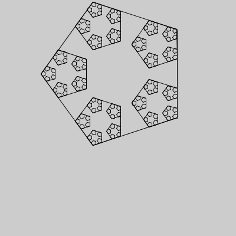

# Caneta automática	

### módulo caneta_automatica.py 

> Este módulo é uma tentativa de fazer com mínimos elementos uma ferramenta de desenho inspirada na tartatuga desenhadora da linguagem Logo. Leia mais sobre Logo em  <https://pt.wikipedia.org/wiki/Logo>. Você vai precisar do [Processing modo Python](https://abav.lugaralgum.com/como-instalar-o-processing-modo-python/).

O módulo *caneta_automatica.py*  deve estar na pasta do seu *sketch* , se tornando uma aba do ide. Baixe o arquivo ou Copie e cole o conteúdo de [caneta_automatica.py](https://raw.githubusercontent.com/villares/material-aulas/master/caneta_automatica/caneta_automatica.py) em uma aba de nome 'caneta_automatica' (o processing acrescenta '.py' no arquivo)..

Para importar e iniciar, use as seguintes linhas: 

```pyde
form caneta_automatica import *

size(400, 400)  # área de desenho do Processing
inicie_caneta()
```

### Um exemplo de uso

```pyde
from caneta_automatica import *

size(400, 400)
inicie_caneta()

def flor(n, tamanho):
    for passo in range(n):
        ande(tamanho)
        vire(360 / n)
        if tamanho > 5:
            flor(n, tamanho / 3)

suba_caneta()
ande(100)
esquerda() # equivale a 'vire(90)'  
baixe_caneta()
    
flor(5, 150)
```


### Como o módulo `caneta_automatica.py` é feito por dentro?

A função `inicie_caneta()`prepara o terreno cirando uma variável `caneta` que vai dizer se a caneta está no papel (abaixada, `True`) ou levantanda (`False`). Fazer com que ela comece abaixada e mudar as coordenadas do desenho para que o x=0 e y=0 sejam no meio da tela:

```pyde
def inicie_caneta():
    global caneta  # avisa que este é um nome global
    # vamos cria se não houver o nome 'caneta'
    caneta = True  # e apontar para o valor True 
    translate(width / 2, height / 2)  # muda o 0, 0 pro meio
    rotate(HALF_PI)  # vira o sistema de coordenadas 90 graus
```


As funções `suba _caneta()` e  `baixe_caneta()` vão alterar o estado da caneta mudando a variável global, indicadora do estado da caneta, `caneta`:

```pyde
def suba_caneta():
    global caneta
    caneta = False

def baixe_caneta():
    global caneta
    caneta = True
```

Agora a parte mais bacana! Ao andar, vamos sempre deslocar a origem (x=0, y=0 do Processing)  para a posição final da caneta (`n` para frente).  Mas primero, se a caneta estiver abaixada (`True`) vamos desenhar uma linha da posição atual (0, 0) para a posição final (0, n), onde `n` é o valor da distância que recebemos para andar:

```pyde
def ande(n):
    if caneta:
        line(0, -n, 0, 0)
    translate(0, -n)
```

Para virar,  vamos converter o ângulo em graus para radianos com `radians()`e girar o sistema de coordenadas!

```pyde
def vire(a):
	# inverte para que ângulo positivo fique anti-hórario
    rotate(radians(-a))  
    
def esquerda():
    vire(90)

def direita():
    vire(-90)

```


